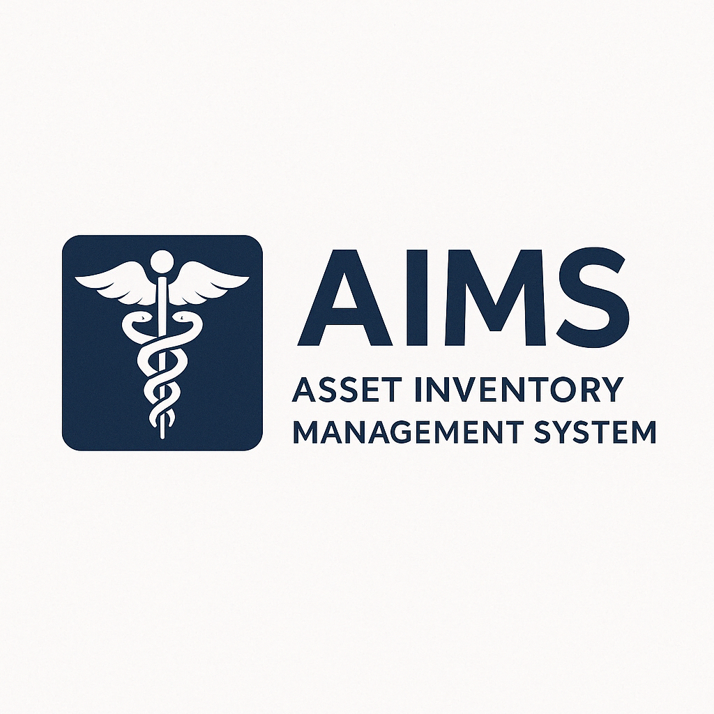
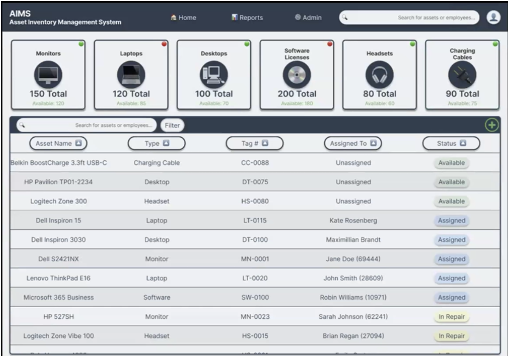

# AIMS - Asset Inventory Management System



## Project Overview

An Asset Inventory Management System built for the Medical Board of California, a local state agency. The IT Asset Tracking System will be a web-based application that provides a structured and automated approach for managing IT assets, tracking asset lifecycle, and enhancing accountability. This system will be designed to integrate with the Medical Board’s existing Microsoft-based infrastructure, supporting role-based access, workflow automation, and audit logging for IT staff.

## Installation Instructions

Follow these steps to set up the AIMS (Asset Inventory Management System) project on your local machine.

### Prerequisites

-   **Docker**: Ensure that Docker is installed on your machine.

> **Apple Silicon Macs (M1/M2/M3):**
> SQL Server only publishes `amd64` images, so Docker must emulate x86 using **Rosetta 2**.
>
> 1. Install Rosetta if you don’t already have it:
>
>     ```bash
>     softwareupdate --install-rosetta
>     ```
>
>     (If it’s already installed, this command will say so.)
>
> 2. In **Docker Desktop**, go to **Settings → Features in development** and enable
>    **“Use Rosetta for x86/amd64 emulation on Apple Silicon”**.
>
> 3. Our `docker-compose.dev.yml` already includes:
>     ```yaml
>     platform: linux/amd64
>     ```
>     so Docker will automatically use Rosetta when starting the SQL Server container.

-   **Visual Studio Code (VS Code)**: Clone the GitHub AIMS project onto your IDE (VS Code).

**Video Tutorial for Cloning**:
[Watch Here](https://www.youtube.com/watch?v=ILJ4dfOL7zs)

### Steps to Set Up the Project

1. **Clone the Repository**

    - Clone the AIMS project repository to your local machine.

2. **Open Terminal in VS Code**

    - In VS Code, open the terminal and run the following command to verify Docker is installed:
        ```bash
        docker --version
        ```

3. **Start Containers**

    - Preferred (new scripts with better cross-platform support):

        ```bash
        ./scripts/up_stack.sh dev
        ./scripts/db_ready.sh dev ensure
        ```

        These scripts:

        - Wait for SQL Server to be healthy.
        - Run EF Core migrations in the container automatically.
        - Support Mac, Windows, and Linux.

    - Legacy (old script, still available):
        ```bash
        ./scripts/build_containers.sh dev
        ```
        Differences:
        - Uses a simpler wait loop.
        - Sometimes skips EF migrations if the container name doesn’t match.
        - Kept for reference but we recommend **up_stack.sh + db_ready.sh**.

4. **Check Running Containers**

    - Once the build is complete, run the following command to see the running containers:
        ```bash
        docker ps
        ```
    - This should display both the **SQL Server** and **ASP.NET Core** containers.

5. **Connect to SQL Server**

    - For **Windows**:

        - Run this command in VS Code’s terminal to connect to SQL Server:

            ```bash
            sqlcmd -S localhost -U sa -P 'StrongP@ssword!'
            ```

            _Note: The password can be found in the `docker-compose.yml` file._

        - **To install `mssql-tools` on Windows**, you need to download and install the SQL Server Command Line Tools. Follow these steps:

        1. Download the **Microsoft ODBC Driver 17 for SQL Server** and **SQLCMD** from the [official Microsoft site](https://docs.microsoft.com/en-us/sql/connect/odbc/download-odbc-driver-for-sql-server).
        2. Run the installer and follow the setup instructions.
        3. After installation, open a new **Command Prompt** or **PowerShell** window and verify the installation by running:
            ```bash
            sqlcmd -?
            ```

    - For **Mac**:

        - First, you’ll need to install `mssql-tools` using **Homebrew**:
            ```bash
            brew install mssql-tools
            ```
        - Then, run the following command to connect to SQL Server:
            ```bash
            sqlcmd -S localhost -U sa -P 'StrongP@ssword!' -C
            ```

    - **Alternative (Without Installing mssql-tools)**:
        - Run the following command in VS Code’s terminal:
            ```bash
            docker exec -it sqlserver2017 sqlcmd -S localhost -U sa -P "StrongP@ssword!"
            ```
            _Note: For the production version, the password will not be in the `docker-compose.yml` file. Instead, it will be stored in a `secrets/.env` file for better security and management._

6. **Verify Database Connection**

    - After running the connection command, run the following query to check if you’re connected to the database:
        ```sql
        SELECT name FROM sys.databases;
        GO
        ```
    - You should see a list of system databases:
        ```
        name
        -----------------
        master
        tempdb
        model
        msdb
        AIMS
        (5 rows affected)
        ```

7. **Verify ASP.NET Core App**

    - Open a browser window and enter the following URL to verify the ASP.NET Core application is working:

        ```
        http://localhost:5119
        ```

        _Note: The correct port number is specified in the `docker-compose.yml` file._

    - Swagger UI will be available at:

    ```
    http://localhost:5119/swagger/index.html
    ```

8. **Azure Entra Authentication(For Devs during testing)**

    - Use your CSUS SSO for sign in purposes, by default devs are all registered as admins.

    - To switch to a different role stop the scripts, go to `ClaimsPrincipalExtensions.cs` to change your account to Help Desk or Supervisor.

    - Once you sign in, you should see the page of your respective role: Help Desk, Supervisor or Admin.

    - NOTE: Admin and Help Desk have the same UI landing page, Help Desk has lack of adding/assigning assets/editing.

### Final Check

If all the above steps are successful, you have successfully set up your development environment and the AIMS project is ready to use!

---

## Database Setup & Smoke Tests

For EF Core migrations, reseeding, and API verification with curl smoke tests, see [DatabaseSetup.md](DatabaseSetup.md).

---

## Usage

To interact with the AIMS (Asset Inventory Management System) Docker containers, use the following commands.

### 1. **Create and Start the Containers**

-   Run the following command to build and start the containers:

    ```bash
    ./scripts/up_stack.sh dev
    ```

-   This script:
    -   Builds the **web** and **SQL Server** containers.
    -   Waits for SQL Server to become **healthy**.
    -   Leaves them running in the background.

⚠️ **Note on old script**:
Previously, we used `./scripts/build_containers.sh dev`. That script bundled _both_ container startup **and** EF migrations in one step. The new approach **splits concerns**:

-   `up_stack.sh` → brings the stack up, waits for SQL to be healthy.
-   `db_ready.sh` → ensures the `AIMS` database exists, applies migrations, and can reseed when needed.
    This separation makes failures easier to debug and improves cross-platform reliability.

---

### 2. **Prepare the Database**

-   To ensure the database exists and apply EF migrations:

    ```bash
    ./scripts/db_ready.sh dev ensure
    ```

-   To **reseed** (drop and recreate the DB):

    ```bash
    ./scripts/db_ready.sh dev reseed
    ```

⚠️ Use `reseed` carefully — it wipes all data.
The script runs inside the `web-dev` container, so EF migrations/seeding use the **same environment** as the app.

---

### 3. **Stop the Container**

-   To stop all running dev containers without deleting them:

    ```bash
    docker compose -f docker-compose.dev.yml stop
    ```

---

### 4. **Restart the Container**

-   To restart containers while keeping all data:

    ```bash
    docker compose -f docker-compose.dev.yml start
    ```

---

## Git Hooks / Code Formatting

To enforce consistent formatting via `.editorconfig`, we use a **pre-commit hook** that runs `dotnet-format`.

Run these commands once after cloning:

### macOS/Linux

```bash
dotnet tool restore
git config core.hooksPath .githooks
chmod +x .githooks/pre-commit
```

### Windows (PowerShell)

```powershell
dotnet tool restore
git config core.hooksPath .githooks
# Make sure the hook script is executable for PowerShell
Set-ExecutionPolicy -Scope Process -ExecutionPolicy Bypass
```

From then on, every commit will be blocked if formatting issues are detected.

---

### 5. **Special Note for Apple Silicon (M1/M2/M3)**

SQL Server is **x86_64 only**. On Apple Silicon, Docker must emulate it using **Rosetta**.

Make sure Docker Desktop → **Settings** → **Features in Development** → ✅ **Use Rosetta for x86/amd64 emulation** is enabled.
Without this, the SQL Server container will fail to start.

---

This is what the home screen will look like:



## Design


# Features

-   **Automated Maintenance Reminders**: Automatically notify users when an asset is due for maintenance.
-   **Role-Based Access Control**: Secure permissions and ensure only authorized users can access sensitive information and perform specific actions.
-   **Audit Logging & Automated Reporting**: Track user actions and generate reports automatically for accountability and transparency.
-   **Dashboard Analytics**: Gain insights into asset usage through visual analytics and real-time data updates.

---

# Contributors

-   **Akal Ustat Singh**
-   **Niyant Nanavati**
-   **Cameron Lanzaro**
-   **Keerat Khandpur**
-   **Suhail Najimudeen**
-   **Norin Phlong**
-   **Tyler Burguillos**
-   **Hanna Kaur**

---

# Technologies Used

### Development Environment

-   **VS Code**: Integrated development environment (IDE) for coding and debugging.
-   **Docker**: Containerization tool to ensure consistency across environments.

### Frontend

-   **C#**: Main programming language for backend logic.
-   **JavaScript**: For dynamic client-side interactions.
-   **HTML/CSS**: Structure and styling of web pages.
-   **Razor Pages**: ASP.NET Core technology for dynamic content rendering.

### Backend

-   **Microsoft SQL Server 2016+**: Relational database system for managing assets and users.
-   **Entity Framework**: ORM (Object-Relational Mapping) for database interactions.
-   **LINQ**: Language Integrated Query for data manipulation.
-   **APIs**:
    -   **Microsoft Graph API**: Manage user roles and permissions.
    -   **Entra ID**: Authentication service for secure login.

### Servers

-   **Azure**: Cloud platform used for hosting and managing applications and databases.

---

# Planned Features

-   **Finalize Role-Based Access Control**: Complete implementation of role-based security features.
-   **Implement Survey Notes + Popup Feature**: Add the ability for users to leave notes and display them in popups.
-   **Rename and Update Roles**: Adjust user roles based on client feedback.
-   **Connect Local Database with MBC through Microsoft Entra**: Ensure seamless integration with Microsoft Entra for authentication and authorization.

---

# Timeline

### Sprint 5 (8/25/25 - 9/7/25)

-   Set up **Role-Based Authorization** in the backend.
-   Connect **Frontend Forms** to the API.
-   Implement **Assignment API**.

### Sprint 6 (9/8/25 - 9/21/25)

-   Test the functionality and limits of the **Authentication Page** to ensure seamless and secure logins for clients.
-   Implement **Role-Based Permissions** for asset history editing.
-   **Undo Asset Deletions** by moving them to the archive instead of permanent deletion.

### Sprint 7 (9/22/25 - 10/5/25)

-   Implement **Asset History View**.
-   Build **Asset Reassignment Workflow**.

### Sprint 8 (10/6/25 - 10/19/25)

-   Test all **Assignment API Features**.

---

# Testing

To be completed as part of **CSC 191**.

---

# Deployment

To be done as part of **CSC 191**.

---

# Developer Instructions

To be completed as part of **CSC 191**.
