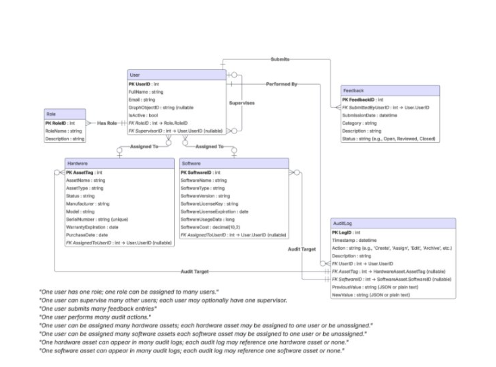

# AIMS - Asset Inventory Management System


## Project Overview

An Asset Inventory Management System built for the Medical Board of California, a local state agency. The IT Asset Tracking System will be a web-based application that provides a structured and automated approach for managing IT assets, tracking asset lifecycle, and enhancing accountability. This system will be designed to integrate with the Medical Board’s existing Microsoft-based infrastructure, supporting role-based access, workflow automation, and audit logging for IT staff.

## Installation Instructions

Follow these steps to set up the AIMS (Asset Inventory Management System) project on your local machine.

### Prerequisites

-   **Docker**: Ensure that Docker is installed on your machine.
-   **Visual Studio Code (VS Code)**: Clone the GitHub AIMS project onto your IDE (VS Code).

**Video Tutorial for Cloning**:
[Watch Here](https://www.youtube.com/watch?v=ILJ4dfOL7zs)

### Steps to Set Up the Project

1. **Clone the Repository**

    - Clone the AIMS project repository to your local machine.

2. **Open Terminal in VS Code**

    - In VS Code, open the terminal and run the following command to verify Docker is installed:
        ```bash
        docker --version
        ```

3. **Run Docker Compose Script**

    - Run the following command in the terminal to build and start the project with the required Docker containers:
        ```bash
        ./scripts/docker_compose.sh
        ```

4. **Check Running Containers**

    - Once the build is complete, run the following command to see the running containers:
        ```bash
        docker ps
        ```
    - This should display both the **SQL Server** and **ASP.NET Core** containers.

5. **Connect to SQL Server**

    - For **Windows**:

        - Run this command in VS Code’s terminal to connect to SQL Server:
            ```bash
            sqlcmd -S localhost -U sa -P 'YourSecurePassword!'
            ```
            _Note: The password can be found in the `docker-compose.yml` file._

    - For **Mac**:

        - First, you’ll need to install `mssql-tools` using **Homebrew**:
            ```bash
            brew install mssql-tools
            ```
        - Then, run the following command to connect to SQL Server:
            ```bash
            sqlcmd -S localhost -U sa -P 'YourSecurePassword!'
            ```

    - **Alternative (Without Installing mssql-tools)**:
        - Run the following command in VS Code’s terminal:
            ```bash
            docker exec -it sqlserver2017 sqlcmd -S localhost -U sa -P "StrongP@ssword!"
            ```

6. **Verify Database Connection**

    - After running the connection command, run the following query to check if you’re connected to the database:
        ```sql
        SELECT name FROM sys.databases;
        GO
        ```
    - You should see a list of system databases:
        ```
        name
        -----------------
        master
        tempdb
        model
        msdb
        (4 rows affected)
        ```

7. **Verify ASP.NET Core App**
    - Open a browser window and enter the following URL to verify the ASP.NET Core application is working:
        ```
        http://localhost:0000
        ```
        _Note: The correct port number is specified in the `docker-compose.yml` file._

### Final Check

If all the above steps are successful, you have successfully set up your development environment and the AIMS project is ready to use!

## Usage

To interact with the AIMS (Asset Inventory Management System) Docker containers, use the following commands.

### 1. **Create and Start the Container**

-   Run the following command to create and start the container initially:

    ```bash
    ./scripts/docker_compose.sh

    ```

-   This script contains three commands:
    -   **Starts the container in detached mode** (in the background).
    -   **Prints a list of containers** running in the project.
    -   **Shows the logs** in real time.

### 2. **Stop the Container**

-   To stop the container without deleting it, run:

bash
./scripts/stop_docker.sh

-   This script contains one command that stops the container while retaining all data.

### 3. **Restart the Container**

-   To restart the container and retain information from the last session, use:

bash
./scripts/start_docker.sh

-   This script contains one command that restarts the container without losing previous session data.

This is what the home screen will look like:


## Design



# Features

-   **Automated Maintenance Reminders**: Automatically notify users when an asset is due for maintenance.
-   **Role-Based Access Control**: Secure permissions and ensure only authorized users can access sensitive information and perform specific actions.
-   **Audit Logging & Automated Reporting**: Track user actions and generate reports automatically for accountability and transparency.
-   **Dashboard Analytics**: Gain insights into asset usage through visual analytics and real-time data updates.

---

# Contributors

-   **Akal Ustat Singh**
-   **Niyant Nanavati**
-   **Cameron Lanzaro**
-   **Keerat Khandpur**
-   **Suhail Najimudeen**
-   **Norin Phlong**
-   **Tyler Burguillos**
-   **Hanna Kaur**

---

# Technologies Used

### Development Environment

-   **VS Code**: Integrated development environment (IDE) for coding and debugging.
-   **Docker**: Containerization tool to ensure consistency across environments.

### Frontend

-   **C#**: Main programming language for backend logic.
-   **JavaScript**: For dynamic client-side interactions.
-   **HTML/CSS**: Structure and styling of web pages.
-   **Razor Pages**: ASP.NET Core technology for dynamic content rendering.

### Backend

-   **Microsoft SQL Server 2016+**: Relational database system for managing assets and users.
-   **Entity Framework**: ORM (Object-Relational Mapping) for database interactions.
-   **LINQ**: Language Integrated Query for data manipulation.
-   **APIs**:
    -   **Microsoft Graph API**: Manage user roles and permissions.
    -   **Entra ID**: Authentication service for secure login.

### Servers

-   **Azure**: Cloud platform used for hosting and managing applications and databases.

---

# Planned Features

-   **Finalize Role-Based Access Control**: Complete implementation of role-based security features.
-   **Implement Survey Notes + Popup Feature**: Add the ability for users to leave notes and display them in popups.
-   **Rename and Update Roles**: Adjust user roles based on client feedback.
-   **Connect Local Database with MBC through Microsoft Entra**: Ensure seamless integration with Microsoft Entra for authentication and authorization.

---

# Timeline

### Sprint 5 (8/25/25 - 9/7/25)

-   Set up **Role-Based Authorization** in the backend.
-   Connect **Frontend Forms** to the API.
-   Implement **Assignment API**.

### Sprint 6 (9/8/25 - 9/21/25)

-   Test the functionality and limits of the **Authentication Page** to ensure seamless and secure logins for clients.
-   Implement **Role-Based Permissions** for asset history editing.
-   **Undo Asset Deletions** by moving them to the archive instead of permanent deletion.

### Sprint 7 (9/22/25 - 10/5/25)

-   Implement **Asset History View**.
-   Build **Asset Reassignment Workflow**.

### Sprint 8 (10/6/25 - 10/19/25)

-   Test all **Assignment API Features**.

---

# Testing

To be completed as part of **CSC 191**.

---

# Deployment

To be done as part of **CSC 191**.

---

# Developer Instructions

To be completed as part of **CSC 191**.
