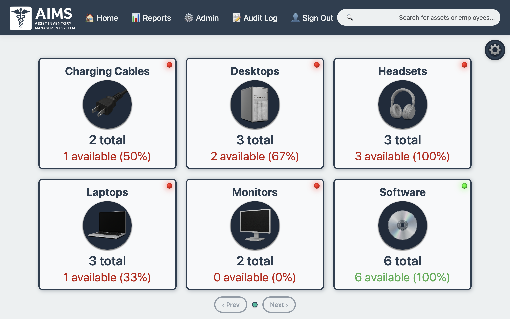
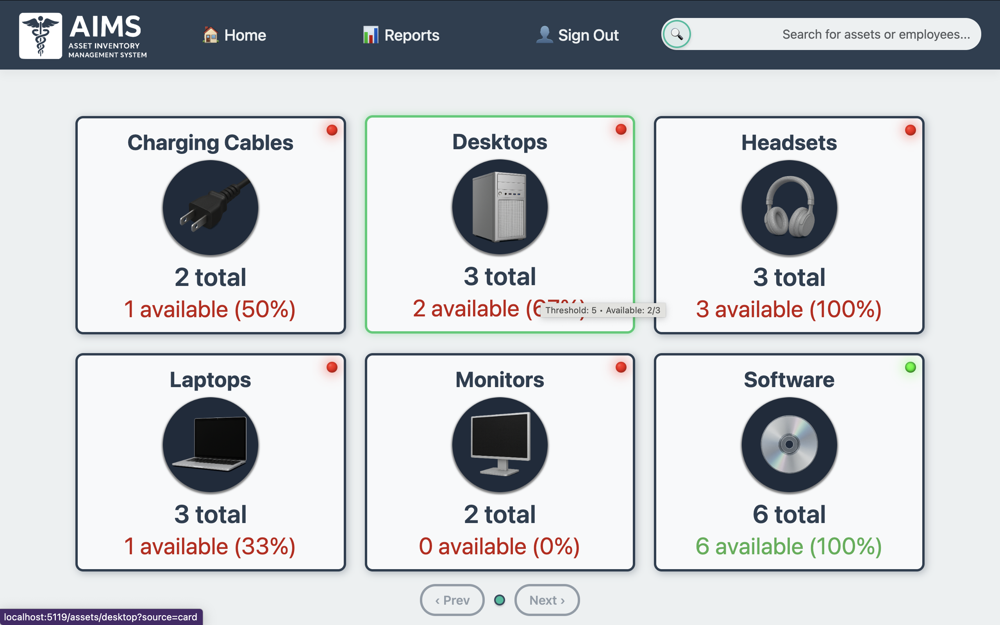
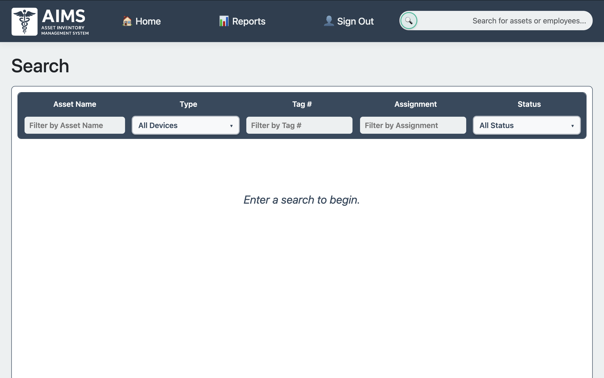
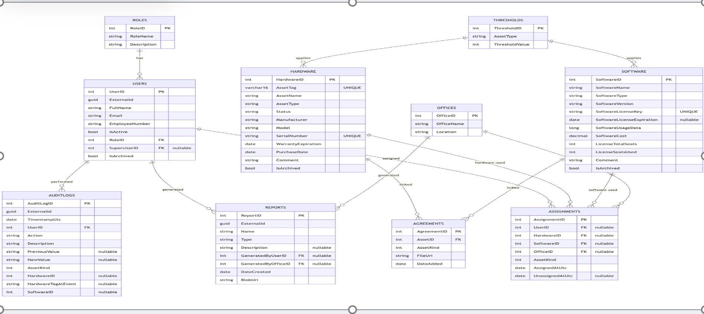
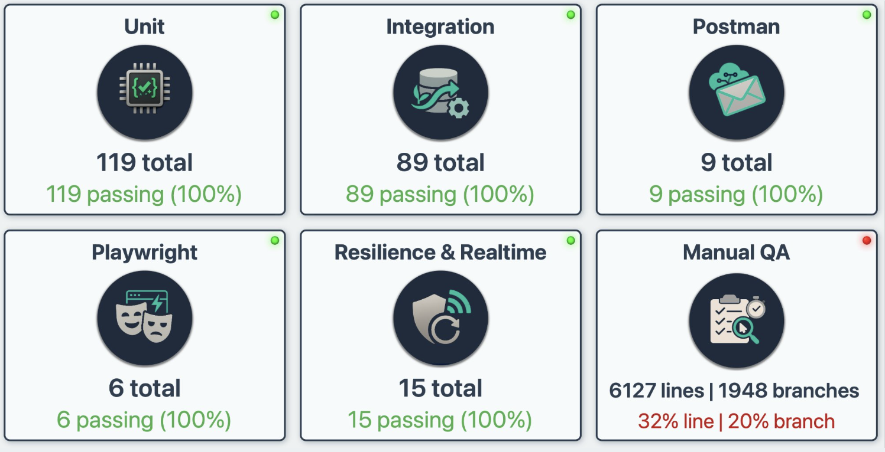
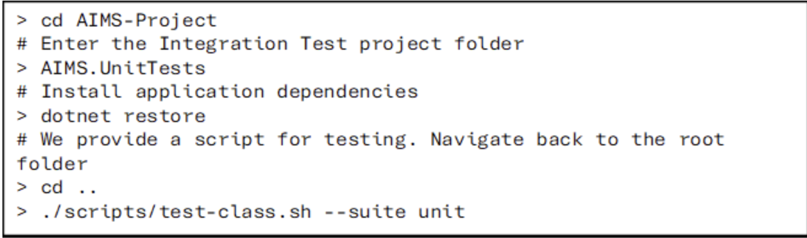
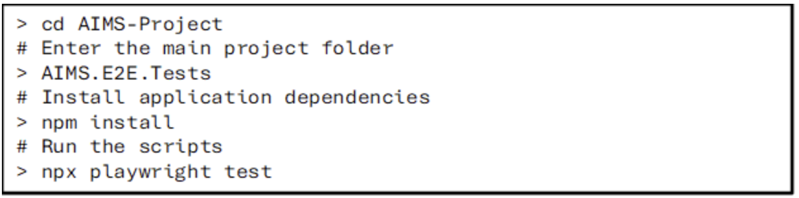

# AIMS - Asset Inventory Management System


## Project Overview

An Asset Inventory Management System built for the Medical Board of California, a local state agency. The IT Asset Tracking System will be a web-based application that provides a structured and automated approach for managing IT assets, tracking asset lifecycle, and enhancing accountability. This system will be designed to integrate with the Medical Board’s existing Microsoft-based infrastructure, supporting role-based access, workflow automation, and audit logging for IT staff.

## System Requirements

| Component                                  | Version / Details                           |
| ------------------------------------------ | ------------------------------------------- |
| **.NET**                                   | 9.0                                         |
| **Node.js**                                | 20.11.1                                     |
| **Docker**                                 | 4.52.0                                      |
| **Operating Systems Used for Development** | Windows 11, macOS Sequoia, macOS Tahoe      |
| **Version Control**                        | Git                                         |
| **Shell**                                  | Bash                                        |
| **Hosting Target**                         | IIS on Windows Server 2019 Datacenter       |
| **Authentication / Authorization**         | Microsoft Entra ID (Azure Active Directory) |

## Testing Frameworks

| Framework / Tool  | Version |
| ----------------- | ------- |
| **Moq**           | 4.20.72 |
| **xUnit**         | 2.9.2   |
| **Playwright**    | 1.56.1  |
| **Postman**       | 11.70.7 |
| **.NET Test SDK** | 17.12.0 |
| **TypeScript**    | 5.9.3   |

## Development Environment

| Component              | Version / Details                                       |
| ---------------------- | ------------------------------------------------------- |
| **Visual Studio Code** | 1.106                                                   |
| **Backend**            | Microsoft C# .NET 9.0                                   |
| **ORM**                | Entity Framework                                        |
| **Database**           | SQL Server 2016+ (installed via provided Docker script) |

## Installing the System Requirements

---

## .NET 9.0 SDK

Users must install the **.NET 9.0 SDK**.

**Option 1: Download Manually**
Download directly from the official .NET website:
https://dotnet.microsoft.com/en-us/download/dotnet/9.0

**Option 2: Install via Visual Studio Code (Recommended)**
The **C# Dev Kit Extension** for VSCode can automatically install the .NET SDK.

1. Install Visual Studio Code:
   https://code.visualstudio.com/download
2. Open VSCode and navigate to the **Extensions** tab on the left sidebar.
   Docs: https://code.visualstudio.com/docs/configure/extensions/extension-marketplace
3. Install the **C# Dev Kit** extension:
   https://marketplace.visualstudio.com/items?itemName=ms-dotnettools.csdevkit
4. After cloning the AIMS repository (see instructions later), open it in VSCode.
   The C# extension will detect the `.csproj` file and prompt you to install the SDK.
   Follow the on-screen instructions.

---

## Node.js

Download and install Node.js from:
https://nodejs.org/en/download

Follow the installation wizard to complete setup.

---

### Docker Desktop

Docker Desktop provides the CLI and GUI for container management.

Download Docker Desktop:
https://docs.docker.com/desktop/

Run the installer and follow the steps in the setup wizard.

---

### Git Version Control

To install Git, download it from:
https://git-scm.com/install/mac

Installing Git also installs **Git Bash**, which is recommended for Windows users.

---

### Bash Shell

-   **macOS/Linux:** Bash is installed by default.
-   **Windows:** Use **Git Bash**, included when you install Git.

To integrate Bash with VSCode, follow the official guide:
https://code.visualstudio.com/docs/terminal/shell-integration

---

## Installing the Development Environment

### ### Visual Studio Code

Install Visual Studio Code (latest version recommended):
https://code.visualstudio.com/Download

## Running the application (DEVS)

Follow these steps to set up the AIMS (Asset Inventory Management System) project on your local machine.

### Prerequisites

-   **Docker**: Ensure that Docker is installed on your machine.

> **Apple Silicon Macs (M1/M2/M3):**
> SQL Server only publishes `amd64` images, so Docker must emulate x86 using **Rosetta 2**.
>
> 1. Install Rosetta if you don’t already have it:
>
>     ```bash
>     softwareupdate --install-rosetta
>     ```
>
>     (If it’s already installed, this command will say so.)
>
> 2. In **Docker Desktop**, go to **Settings → Features in development** and enable
>    **“Use Rosetta for x86/amd64 emulation on Apple Silicon”**.
>
> 3. Our `docker-compose.dev.yml` already includes:
>     ```yaml
>     platform: linux/amd64
>     ```
>     so Docker will automatically use Rosetta when starting the SQL Server container.

-   **Visual Studio Code (VS Code)**: Clone the GitHub AIMS project onto your IDE (VS Code).

**Video Tutorial for Cloning**:
[Watch Here](https://www.youtube.com/watch?v=ILJ4dfOL7zs)

### Steps to Set Up the Project

1. **Clone the Repository**

    - Clone the AIMS project repository to your local machine.

2. **Open Terminal in VS Code**

    - In VS Code, open the terminal and run the following command to verify Docker is installed:
        ```bash
        docker --version
        ```

3. **Start Containers**

    - Preferred (new scripts with better cross-platform support):

        ```bash
        ./scripts/up_stack.sh dev
        ./scripts/db_ready.sh dev ensure
        ```

        These scripts:

        - Wait for SQL Server to be healthy.
        - Run EF Core migrations in the container automatically.
        - Support Mac, Windows, and Linux.

    - Legacy (old script, still available):
        ```bash
        ./scripts/build_containers.sh dev
        ```
        Differences:
        - Uses a simpler wait loop.
        - Sometimes skips EF migrations if the container name doesn’t match.
        - Kept for reference but we recommend **up_stack.sh + db_ready.sh**.

4. **Check Running Containers**

    - Once the build is complete, run the following command to see the running containers:
        ```bash
        docker ps
        ```
    - This should display both the **SQL Server** and **ASP.NET Core** containers.

5. **Connect to SQL Server**

    - For **Windows**:

        - Run this command in VS Code’s terminal to connect to SQL Server:

            ```bash
            sqlcmd -S localhost -U sa -P 'StrongP@ssword!'
            ```

            _Note: The password can be found in the `docker-compose.yml` file._

        - **To install `mssql-tools` on Windows**, you need to download and install the SQL Server Command Line Tools. Follow these steps:

        1. Download the **Microsoft ODBC Driver 17 for SQL Server** and **SQLCMD** from the [official Microsoft site](https://docs.microsoft.com/en-us/sql/connect/odbc/download-odbc-driver-for-sql-server).
        2. Run the installer and follow the setup instructions.
        3. After installation, open a new **Command Prompt** or **PowerShell** window and verify the installation by running:
            ```bash
            sqlcmd -?
            ```

    - For **Mac**:

        - First, you’ll need to install `mssql-tools` using **Homebrew**:
            ```bash
            brew install mssql-tools
            ```
        - Then, run the following command to connect to SQL Server:
            ```bash
            sqlcmd -S localhost -U sa -P 'StrongP@ssword!' -C
            ```

    - **Alternative (Without Installing mssql-tools)**:
        - Run the following command in VS Code’s terminal:
            ```bash
            docker exec -it sqlserver2017 sqlcmd -S localhost -U sa -P "StrongP@ssword!"
            ```
            _Note: For the production version, the password will not be in the `docker-compose.yml` file. Instead, it will be stored in a `secrets/.env` file for better security and management._

6. **Verify Database Connection**

    - After running the connection command, run the following query to check if you’re connected to the database:
        ```sql
        SELECT name FROM sys.databases;
        GO
        ```
    - You should see a list of system databases:
        ```
        name
        -----------------
        master
        tempdb
        model
        msdb
        AIMS
        (5 rows affected)
        ```

7. **Verify ASP.NET Core App**

    - Open a browser window and enter the following URL to verify the ASP.NET Core application is working:

        ```
        http://localhost:5119
        ```

        _Note: The correct port number is specified in the `docker-compose.yml` file._

    - Swagger UI will be available at:

    ```
    http://localhost:5119/swagger/index.html
    ```

8. **Azure Entra Authentication(For production)**

    - Use your MBC SSO to sign in to the application. Role based access is configured through Microsoft Azure Entra and users need to be added through the Azure portal before being allowed to access the application.

    - Once you sign in, you should see the page of your respective role: Help Desk, Supervisor or Admin.

    - NOTE: Admin and Help Desk have the same UI landing page, Help Desk has READ ONLY access to the application.

### Final Check

If all the above steps are successful, you have successfully set up your development environment and the AIMS project is ready to use!

---

## Database Setup & Smoke Tests

For EF Core migrations, reseeding, and API verification with curl smoke tests, see [DatabaseSetup.md](DatabaseSetup.md).

---

## Usage

To interact with the AIMS (Asset Inventory Management System) Docker containers, use the following commands.

### 1. **Create and Start the Containers**

-   Run the following command to build and start the containers:

    ```bash
    ./scripts/up_stack.sh dev
    ```

-   This script:
    -   Builds the **web** and **SQL Server** containers.
    -   Waits for SQL Server to become **healthy**.
    -   Leaves them running in the background.

⚠️ **Note on old script**:
Previously, we used `./scripts/build_containers.sh dev`. That script bundled _both_ container startup **and** EF migrations in one step. The new approach **splits concerns**:

-   `up_stack.sh` → brings the stack up, waits for SQL to be healthy.
-   `db_ready.sh` → ensures the `AIMS` database exists, applies migrations, and can reseed when needed.
    This separation makes failures easier to debug and improves cross-platform reliability.

---

### 2. **Prepare the Database**

-   To ensure the database exists and apply EF migrations:

    ```bash
    ./scripts/db_ready.sh dev ensure
    ```

-   To **reseed** (drop and recreate the DB):

    ```bash
    ./scripts/db_ready.sh dev reseed
    ```

⚠️ Use `reseed` carefully — it wipes all data.
The script runs inside the `web-dev` container, so EF migrations/seeding use the **same environment** as the app.

---

### 3. **Stop the Container**

-   To stop all running dev containers without deleting them:

    ```bash
    docker compose -f docker-compose.dev.yml stop
    ```

---

### 4. **Restart the Container**

-   To restart containers while keeping all data:

    ```bash
    docker compose -f docker-compose.dev.yml start
    ```

---

## Git Hooks / Code Formatting

To enforce consistent formatting via `.editorconfig`, we use a **pre-commit hook** that runs `dotnet-format`.

Run these commands once after cloning:

### macOS/Linux

```bash
dotnet tool restore
git config core.hooksPath .githooks
chmod +x .githooks/pre-commit
```

### Windows (PowerShell)

```powershell
dotnet tool restore
git config core.hooksPath .githooks
# Make sure the hook script is executable for PowerShell
Set-ExecutionPolicy -Scope Process -ExecutionPolicy Bypass
```

From then on, every commit will be blocked if formatting issues are detected.

---

### 5. **Special Note for Apple Silicon (M1/M2/M3)**

SQL Server is **x86_64 only**. On Apple Silicon, Docker must emulate it using **Rosetta**.

Make sure Docker Desktop → **Settings** → **Features in Development** → **Use Rosetta for x86/amd64 emulation** is enabled.
Without this, the SQL Server container will fail to start.

---

This is what the home screen will look like for Admin, Help Desk and Supervisor Users:

## ADMIN



## HELP DESK



## SUPERVISOR



## Design



# Features

-   **Automated Maintenance Reminders**: Automatically notify users when an asset is due for maintenance.
-   **Role-Based Access Control**: Secure permissions and ensure only authorized users can access sensitive information and perform specific actions.
-   **Audit Logging & Automated Reporting**: Track user actions and generate reports automatically for accountability and transparency.
-   **Dashboard Analytics**: Gain insights into asset usage through visual analytics and real-time data updates.

---

# Contributors

-   **Akal Ustat Singh**
-   **Niyant Nanavati**
-   **Cameron Lanzaro**
-   **Keerat Khandpur**
-   **Suhail Najimudeen**
-   **Norin Phlong**
-   **Tyler Burguillos**
-   **Hanna Kaur**

---

# Technologies Used

### Development Environment

-   **VS Code**: Integrated development environment (IDE) for coding and debugging.
-   **Docker**: Containerization tool to ensure consistency across environments.

### Frontend

-   **C#**: Main programming language for backend logic.
-   **JavaScript**: For dynamic client-side interactions.
-   **HTML/CSS**: Structure and styling of web pages.
-   **Razor Pages**: ASP.NET Core technology for dynamic content rendering.

### Backend

-   **Microsoft SQL Server 2017+**: Relational database system for managing assets and users.
-   **Entity Framework**: ORM (Object-Relational Mapping) for database interactions.
-   **LINQ**: Language Integrated Query for data manipulation.
-   **APIs**:
    -   **Microsoft Graph API**: Manage user roles and permissions.
    -   **Entra ID**: Authentication service for secure login.

### Servers

-   **Azure**: Cloud platform used for hosting and managing applications and databases.
-   **Microsoft IIS Web Server**: developed by Microsoft for hosting websites, web applications, and media services.

### Testing Tools

-   **xUnit** : a free, open source, community-focused unit testing tool for C#, F#, and Visual Basic.
-   **Dapper**: An open-source object-relational mapping (ORM) library for the .NET and .NET Core platforms.
-   **Playright**: framework for end-to-end testing of modern web applications.
-   **Postman**: API development and testing tool, to validate the functionality, performance, and reliability of APIs.

# Testing



The **AIMS** solution is organized into five main project folders:

AIMS
AIMS.UnitTests
AIMS.Tests.Integration
AIMS.Postman.Tests
AIMS.E2E.Tests

### **AIMS.UnitTests**

Unit tests focused on controller logic.
Tools and frameworks used:

-   **xUnit** for test execution
-   **Moq** for mocking dependencies
-   **EF Core In-Memory** for lightweight, reproducible test data
-   **Arrange–Act–Assert** pattern for test consistency

To set up unit tesing, you need to navigate to the AIMS Unit Test folder and install its dependencies. As mentioned previously, a bash shell instance is necessary.



### **AIMS.Tests.Integration**

Integration tests designed to validate the database layer.
Key characteristics:

-   Uses **Dapper** for executing SQL queries
-   Tests against **SQL Server schema constraints**
-   Ensures database-level data integrity and proper constraint behavior

To set up integration testing, you need to navigate to the AIMS Integration Test folder and install its dependencies.


### **AIMS.Postman.Tests**

Tests API functionality and resilience using:

-   **Postman** collections
-   Automated checks to validate backend behavior before UI testing occurs

To configure Postman testing:

1. **Install the Postman VSCode Extension**
   Download here:
   https://marketplace.visualstudio.com/items?itemName=Postman.postman-for-vscode

2. **Open the Postman Panel**
   After installation, navigate to the **Postman** tab in the left Activity Bar.

3. **Import the Postman Test Suite**

    - Click the **cloud icon with an up arrow** (Import).
    - Choose the **“Folder”** option.
    - Select the **AIMS.Postman.Tests** folder in your file explorer.

4. **Configure the Postman Environment**

    - Go to the **Environments** tab.
    - Select **"AIMS Local Environment"**.
    - In the editor window that opens, locate the `clientSecret` row.
    - Insert the **client secret** provided in your deliverable `.env` file.

5. **Run the Test Collection**
    - Return to the **Collections** tab in the Postman panel.
    - Run the collection titled:
      **AIMS — QA (Audit Events: Polling, ETag, Dedup, Resilience)**

---

### **AIMS.E2E.Tests**

End-to-end UI testing powered by **Playwright**.
This suite provides:

-   Full workflow validation from the browser perspective
-   Confidence that the application functions correctly across layers

To configure E2E testing:

1. Navigate to the **AIMS.E2E.Tests** folder.



# Deployment

## Deployment Model

-   Development > Production

-   Docker hosted > On-prem Windows Server + IIS + SQL Server

-   On-prem IIS: Hosts AIMS and serves internal requests through HTTPS

-   On-prem SQL Server: EF Core Migrations will create database schema

-   No cloud hosting except Azure AD & Graph

---

## Compiled DLLs

To compile the AIMS application into a deployable library for MBC, run the following command in a Bash shell:

```bash
dotnet publish AIMS/AIMS.csproj -c Release -o <FOLDER>
```

This command compiles the application in Release mode and outputs the published artifacts to the specified <FOLDER>.

### Repository Access

The AIMS team will provide access to the public GitHub repository so the receiving development team can modify any required configuration values before publishing the code.

### Additional Build Assets

-   wwwroot Bundle – Automatically included as part of the publish command.

-   Entity Framework Migrations – Located in:
    AIMS/Data/Migrations

-   Production appsettings – Can be modified either before or after publishing.

### Handover to MBC

The AIMS team will provide a zipped file containing the compiled code to the MBC development team.
